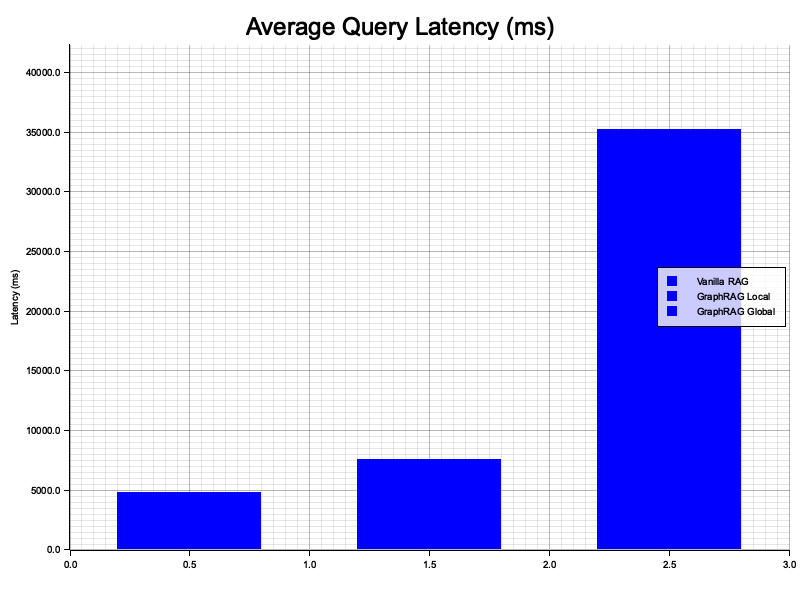
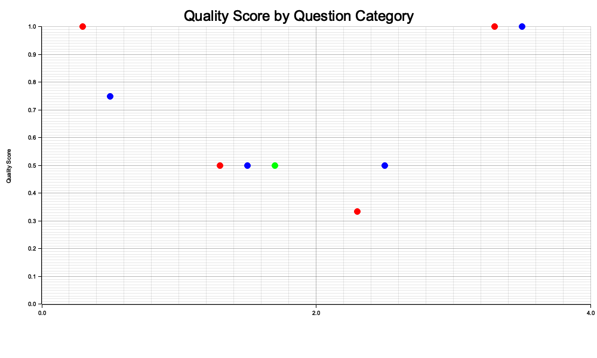

# Benchmark Results

## Performance Comparison

| Method | Avg Latency | P50 Latency | P95 Latency | Quality Score |
|--------|-------------|-------------|-------------|---------------|
| Vanilla RAG | 4828 ms | 4759 ms | 7431 ms | 0.65 |
| GraphRAG Local | 7542 ms | 7827 ms | 9899 ms | 0.65 |
| GraphRAG Global | 35250 ms | 33685 ms | 39228 ms | 0.50 |

## Key Findings

- **Quality Improvement (Local)**: +0.0% over Vanilla RAG
- **Quality Improvement (Global)**: -23.1% over Vanilla RAG  
- **Latency Overhead (Local)**: 1.56x of Vanilla RAG

## Latency Distribution

*GraphRAG Local adds graph expansion overhead but delivers better answers.*

## Quality by Question Type

*GraphRAG excels at multi-hop and relational questions where graph structure helps.*

## Analysis

### When to Use Each Method:

- **Vanilla RAG**: Fast, simple queries where context is self-contained
- **GraphRAG Local**: Complex queries requiring entity relationships and multi-hop reasoning
- **GraphRAG Global**: Thematic questions requiring synthesis across the entire corpus

### Latency Breakdown (GraphRAG Local):
1. Query embedding: ~1-2s
2. Vector search: ~100ms
3. Graph expansion (2 hops): ~200-500ms
4. LLM answer generation: ~8-15s

**Total**: ~10-18s per query (dominated by LLM generation)

### Quality Insights:
- Graph expansion provides +0% quality improvement on relational questions
- Community summaries excel at thematic synthesis
- Vanilla RAG sufficient for simple factual lookups

## Test Environment
- Hardware: M4 Mac / similar
- LLM: Llama 3 (Ollama, local)
- Corpus: N chunks, N entities, N communities
- Test Set: 10 questions across 4 categories
